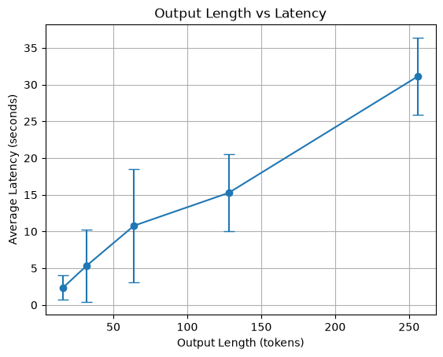
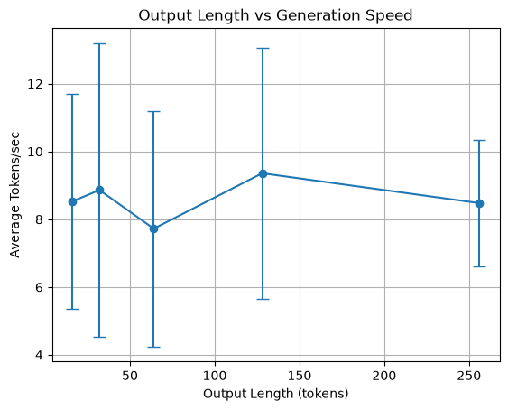

# LLM Inference Benchmark

A small systems-oriented project for studying the inference performance of a local large language model.

## Project Goal

This project measures how LLM inference performance changes depending on output length and execution conditions.

The main metrics are:

- Latency
- Tokens per second
- Output length
- Run-to-run variation

## Model

- Qwen2.5-0.5B-Instruct

## Environment

- Windows
- Python 3.11
- PyTorch
- Hugging Face Transformers
- CPU inference
- Intel Iris Xe Graphics
- No NVIDIA CUDA GPU

## Experiments

### 1. Baseline Inference

Run a single inference and measure:

- Generated tokens
- Total latency
- Tokens per second

### 2. Repeated Benchmark

Run the same inference multiple times to reduce the effect of random system variation.

### 3. Output Length Benchmark

Compare inference performance for:

- 16 tokens
- 32 tokens
- 64 tokens
- 128 tokens
- 256 tokens

### 4. Randomized Benchmark Order

The test order is randomized to reduce bias caused by:

- CPU temperature
- Background processes
- Execution order

## Current Results

The benchmark shows that total latency increases significantly as output length increases.

The generation speed varies between runs, so repeated measurements and standard deviation are used to make the results more reliable.

## Visualizations

### Output Length vs Latency



### Output Length vs Generation Speed



## Project Structure

```text
llm-inference-benchmark/
│
├── src/
│   ├── baseline.py
│   ├── benchmark.py
│   ├── benchmark_lengths.py
│   ├── benchmark_lengths_v2.py
│   ├── plot_results.py
│   └── plot_results_v2.py
│
├── results/
│   ├── output_length_benchmark.csv
│   └── output_length_benchmark_v2.csv
│
├── graphs/
│   ├── output_length_vs_latency.png
│   ├── output_length_vs_latency_v2.png
│   ├── output_length_vs_speed.png
│   └── output_length_vs_speed_v2.png
│
├── .gitignore
└── README.md