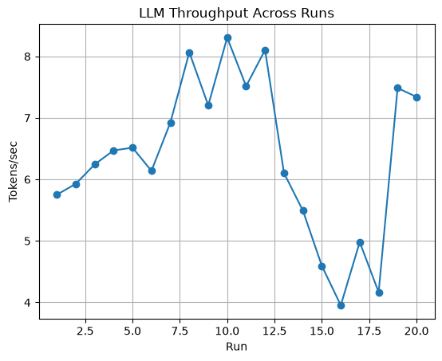
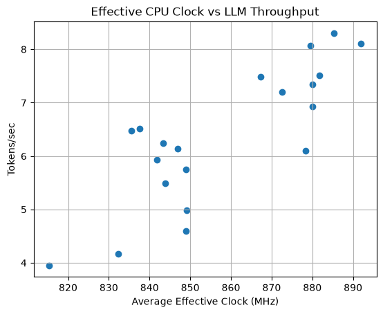
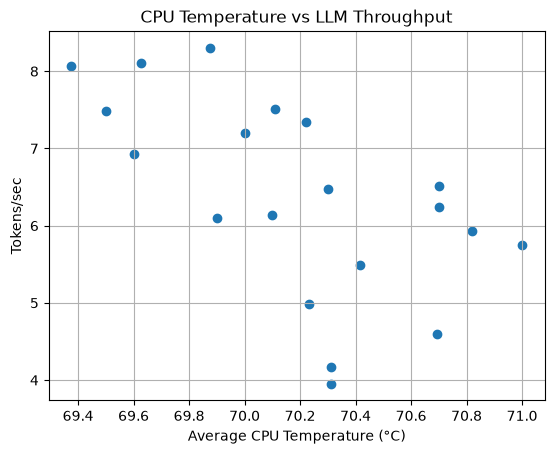

# Thermal and Power Investigation

## Research question and motivation

Why does CPU-based LLM inference throughput vary between runs with the same model, prompt, and output length? In particular, is the variation associated with CPU temperature, thermal throttling, or effective CPU clock?

The [output-length experiments](../README.md#experiment-1--output-length-benchmark) showed substantial run-to-run variation. This follow-up matches repeated inference measurements to HWiNFO sensor samples.

## Initial hypothesis

> Higher CPU temperature causes thermal throttling, reducing effective CPU clock and, in turn, LLM throughput.

This is a hypothesis to test, not an established causal explanation. The measured session did not show the predicted thermal-throttling sequence.

## Environment

| Item | Configuration |
|---|---|
| Platform | Windows laptop, Intel Core i5-1240P |
| Graphics | Intel Iris Xe; no NVIDIA CUDA GPU; inference uses CPU |
| Python | 3.11, as documented in the root README |
| Model | `Qwen/Qwen2.5-0.5B-Instruct` |
| Inference stack | PyTorch and Hugging Face Transformers |
| Model precision and mode | FP32 (`torch.float32`), `model.eval()`, `torch.inference_mode()` |
| Monitoring | HWiNFO sensor CSV, analyzed with pandas; plots with matplotlib |

Exact package versions, HWiNFO version and sampling interval, Windows power mode, CPU thread settings, and AC/battery state are not recorded in the published experiment artifacts. The dependency file therefore does not claim to reproduce a verified version-locked environment.

## Method

The implementation is in [thermal_benchmark.py](../src/thermal_benchmark.py) and [analyze_thermal.py](../src/analyze_thermal.py).

1. Load the model and tokenizer once, then apply the chat template to the fixed prompt: **“Explain what an operating system is.”**
2. Perform one unmeasured 32-token warm-up, with both minimum and maximum new-token counts set to 32.
3. Run 20 consecutive generations with `min_new_tokens=max_new_tokens=128` and `do_sample=False`. All 20 published runs generated 128 new tokens. `REST_SECONDS=0` means there is no intentional cooling interval; normal loop and logging overhead remains.
4. Measure each generation with `time.perf_counter()`. Throughput is generated tokens divided by generation-call latency. This includes prompt processing within `generate()` and decoding; it excludes model loading and tokenization, and is not a decode-only or TTFT measurement.
5. Record wall-clock start/end timestamps alongside latency and throughput while HWiNFO logs sensors. The published session spans 2026-10-01 23:49:09–23:56:09 in the recorded local timestamps (no timezone offset is stored).
6. Select HWiNFO samples inclusively between each run's start and end. Average temperature, effective clock, package power, dynamic PL1, and memory usage within each run. Mark thermal throttling or power-limit exceeded as true if any matched sample contains the Korean value `예`.
7. Compute descriptive statistics and exploratory Pearson correlation across the 20 run-level rows.

The temperature sensor uses `CPU 전체 [°C].1` when available, otherwise `CPU 전체 [°C]`. Effective clock uses `평균 유효 클럭 [MHz]`, an aggregate sensor rather than a clock measurement for a specific inference thread or core.

Unlike the randomized output-length experiment, this thermal experiment uses a fixed length in sequential runs; it does not randomize power or cooling conditions.

## Data and core results

- [Per-run inference measurements](results/llm_thermal_benchmark.csv)
- [Per-run hardware and inference summary](results/thermal_summary.csv)

The following values were recalculated from the published 20-row summary. Means are arithmetic means of run-level values, not duration-weighted averages over all sensor samples.

| Metric | Result |
|---|---:|
| Runs / new tokens per run | 20 / 128 |
| Throughput range | **3.95–8.30 tokens/s** |
| Mean throughput | **6.36 tokens/s** |
| Mean latency | 21.02 s |
| Latency range | 15.41–32.38 s |
| Mean CPU temperature | **70.2 °C** |
| Run-average CPU temperature range | 69.4–71.0 °C |
| Mean effective CPU clock | **858 MHz** |
| Run-average effective clock range | 815–892 MHz |
| Mean CPU package power | Approximately 12 W |
| Dynamic PL1 | **12 W in every run-level summary** |
| Thermal throttling flag | **Not observed in any of the 20 run summaries** |
| Power-limit-exceeded flag | Observed in all 20 run summaries |
| Run-average physical memory usage range | 93.0–97.3% |
| Exploratory clock–throughput Pearson correlation | **r ≈ +0.82** (n = 20) |

The unrounded clock–throughput correlation is approximately +0.822. A true power-limit flag means at least one matched sample was flagged; it does not establish the fraction of each run spent power-limited. Likewise, a false thermal flag means no matching affirmative sample was detected by the analysis, not proof that no brief event occurred between samples.

## Visualizations

### Throughput across runs



[Open throughput plot](graphs/run_vs_throughput.png). Throughput varies substantially and does not simply decline with run number.

### Effective CPU clock versus throughput



[Open effective-clock plot](graphs/clock_vs_throughput.png). Higher run-average effective clock is associated with higher throughput in this session.

### CPU temperature versus throughput



[Open temperature plot](graphs/temperature_vs_throughput.png). Run-average temperatures occupy a narrow range around 70 °C despite the broad throughput range.

## Interpretation

The initial hypothesis is not supported by the observed thermal-throttling flags during these 20 measured runs: temperature remained near 70 °C and no thermal throttling was detected in the matched samples. This does not rule out thermal effects under other conditions.

The session instead shows package power near 12 W, a dynamic PL1 of 12 W in every run summary, power-limit flags in every run, and a positive clock–throughput association. These observations motivate investigating sustained power limits as a possible constraint on inference performance.

**Correlation does not prove causation.** Neither the Pearson correlation nor the power-limit flags demonstrate that PL1 caused the throughput variation. PL1 did not vary across the run summaries, so this dataset cannot estimate the effect of changing PL1. Effective clock and throughput could both respond to background activity, memory pressure, scheduling, or other unmeasured factors.

The [root report](../README.md#important-observation) describes an earlier period with temperatures above 90 °C, thermal throttling, and PL1 decreasing toward 12 W. That period precedes these measurements and is not represented in the published run-level CSVs. Because the raw log is private, those earlier observations cannot be independently checked from the public summary. They do not establish that earlier throttling caused the later 12 W limit.

## Limitations

- One laptop, one model, one prompt, and one 20-run session limit generalization. Sequential runs may be temporally dependent; the correlation is exploratory, without an independent replication or causal test.
- The narrow measured temperature range and absence of detected thermal flags cannot characterize high-temperature behavior.
- Background processes and power-management conditions were not independently controlled. Physical memory usage was high; paging or memory contention was not measured directly.
- Aggregate effective clock cannot isolate active inference cores, scheduler placement, or per-core behavior.
- Wall-clock timestamps are saved only to whole seconds, whereas latency uses a high-resolution timer. Inclusive matching can share boundary samples and misalign subsecond portions of a run. Sensor sampling also may miss brief events.
- The analysis is tied to Korean HWiNFO column names and the value `예`. Numeric conversion can produce missing values; the script does not validate sample counts or coverage before averaging, and an empty segment would also yield false event flags.
- The public summary omits sensor sample counts, event durations, and the underlying time series. It supports recalculating summary statistics, but not independently validating the raw sensor join or regenerating the full analysis from a fresh clone.
- Package versions and the model revision were not pinned for the recorded session. Installing current dependencies does not guarantee identical measurements.

## Next hypothesis and experiment

> Sustained CPU power limits may lower effective CPU clock and thereby contribute to reduced LLM inference throughput.

To test this, capture complete sessions from a relatively cool starting state through sustained load, including the transition in power limit, clock, and throughput. Keep model, prompt, output length, thread count, power supply, and background load consistent and record software versions and memory activity.

Repeat sessions under documented, supported power-mode conditions, randomize their order, and allow comparable cooling between sessions. Record actual PL1 and package power rather than assuming that a power-mode label changes them. Preserve higher-resolution timestamps and report sensor coverage and event duration per run.

A reproducible throughput change following a controlled change in power conditions would provide stronger evidence than the present association. Power modes may alter several settings at once, so even that comparison would need care before attributing an effect specifically to PL1.

## Reproduction and privacy

Install the core Python dependencies from the repository root:

```powershell
python -m pip install -r requirements.txt
```

The current CPU loading path uses `model.to("cpu")` and does not use `device_map` or Accelerate APIs; `accelerate` is not required by the current scripts. HWiNFO is a separate Windows application, not a Python dependency.

To collect a new session, start HWiNFO sensor logging, then run from the repository root:

```powershell
python src/thermal_benchmark.py
```

This overwrites `thermal/results/llm_thermal_benchmark.csv`; preserve any measurements you need before rerunning. For a local sensor join, keep the matching HWiNFO CSV at `thermal/results/hwinfo_log.csv`, verify its encoding, column names, affirmative values, and timestamp alignment, then run:

```powershell
python src/analyze_thermal.py
```

This overwrites the summary and three graphs. It requires the private raw log and cannot run to completion using only the public repository.

The original HWiNFO log remains excluded by [the root .gitignore](../.gitignore) to avoid publishing personal or hardware-identifying information. Do not force-add it. Share only reviewed derived data and plots; the existing raw log is not part of the public repository.

[Return to the project overview](../README.md)
